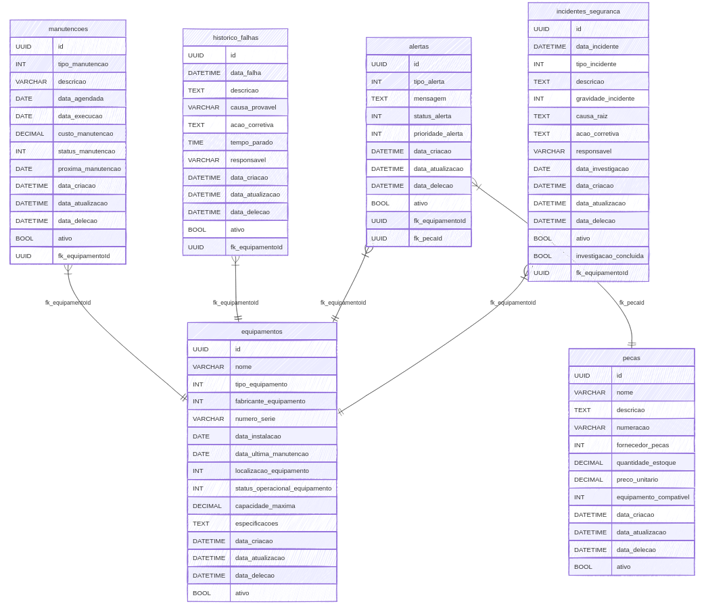

# Gerenciamento de Equipamentos Petrolíferos

Este projeto é um CRUD desenvolvido com o objetivo de estudo e experimentação de arquitetura MVC utilizando .NET e Entity Framework. Ele foca na estruturação e gerenciamento de dados de equipamentos petrolíferos, sem a implementação de views; o intuito principal é explorar conceitos de desenvolvimento, workflows e integração de ferramentas como Docker, Docker Compose e DBeaver para gerenciamento de um banco de dados PostgreSQL.

## Modelagem


## Como rodar?
### Para instalar:
- Docker e Docker Compose;
- .NET SDK 8.+
- DBeaver e Postgresql

### Para clonar:
```
git clone https://github.com/peris-studio/gestao-equipamentos-petroliferos.git
cd src/GestaoEquipamentosPetroliferos
```

### Construir e Iniciar os Containers
```
sudo docker-compose up --build
```